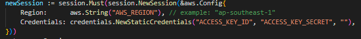

# Go AWS S3 Bucket

# 🛠️ How to Run Locally

- Clone it

```
$ git clone https://github.com/fauzilax/go-aws-s3-simple.git
```

- Go to directory

```
$ cd go-aws-s3-simple
```
- Get API KEY Credential

step 1 : first we need to log in or sign up into our <a href="https://s3.console.aws.amazon.com/s3/get-started?region=ap-southeast-1" >AWS S3 Bucket</a> . Create new bucket

step 2 : you need go to IAM to get credential api key,

step 3 : Now we need to change permission access to public and add code bucket policy

```
{
    "Version": "2012-10-17",
    "Statement": [
        {
            "Sid": "PublicReadGetObjrct",
            "Effect": "Allow",
            "Principal": "*",
            "Action": "s3:GetObject",
            "Resource": "arn:aws:s3:::fauziawsbucket/*"
        }
    ]
}
```

so now we got all api for fill this



- Run the project
```
$ go run .
```
- For Original Source

<a href="https://dev.to/aws-builders/lets-get-started-with-echo-go-aws-sdk-for-go-and-aws-s3-2ac3" >Link</a>

Thanks to Bervianto Leo Pratama for AWS Community Builders
